# 基于springboot+vue的校园失物招领管理系统带万字论文

## 一、介绍

语言: Java 数据库：MySQL 

技术栈：SpringBoot+MybatisPlus+Vue+Html

系统角色：管理员、用户

管理员：管理员：登录、基础数据管理、系统管理、留言板管理、失物信息管理、失物认领管理、寻物启事管理等功能

用户：登录、注册、留言板、公告信息、失物招领、失物认领、寻物启事、个人中心、我发布的失物信息、我的失物认领、我发布的寻物启事、寻物启事留言等功能

### 完整项目获取

通过网盘分享的文件：校园失物招领管理系统

链接: https://pan.baidu.com/s/1WlwrdMJ8mnjOAnRzj9Hcwg?pwd=hst5 提取码: hst5
--来自百度网盘超级会员v3的分享

通过网盘分享的文件：工具包

链接: https://pan.baidu.com/s/1YmdoJvkjoUjA75wvHLDZ6A?pwd=xm96 提取码: xm96
--来自百度网盘超级会员v3的分享

需要远程项目部署或项目修改和毕业设计也可联系（添加申请时请备注好来意）

通过网盘分享的文件：远程调试部署联系方式

链接: https://pan.baidu.com/s/1W0dDcoZmayG0c7USJDYBYg?pwd=nqd7 提取码: nqd7
--来自百度网盘超级会员v3的分享

### 项目合集(项目不断更新中)
链接: https://pan.baidu.com/s/1nY-zhvAK0CXYcn3g7LzQnQ?pwd=id3c 提取码: id3c
--来自百度网盘超级会员v3的分享

#### 这些项目一起发你了 可以分享给你需要的同学 调试可找我 也接二次修改和项目定制、毕业设计等

### 扫码关注公众号 获取更多项目和编程资料

关注公众号：小猿天天学习

公众号ID：xzzard

## 接毕业设计和论文

微信联系方式：xzxj0206  QQ：3808981644   (支持修改、 部署调试、 支持代做毕设)

接网站建设、小程序、H5、APP、各种系统等，单片机、嵌入式也可以做

选题+开题报告+任务书+程序定制+安装调试+论文+答辩ppt  都可以做

## 二、万字论文参考

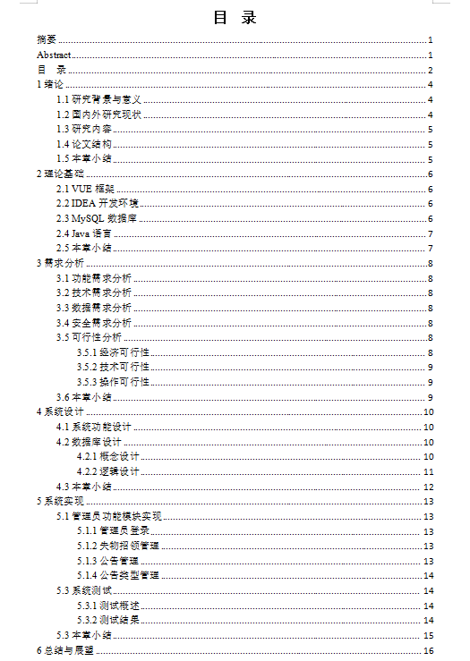

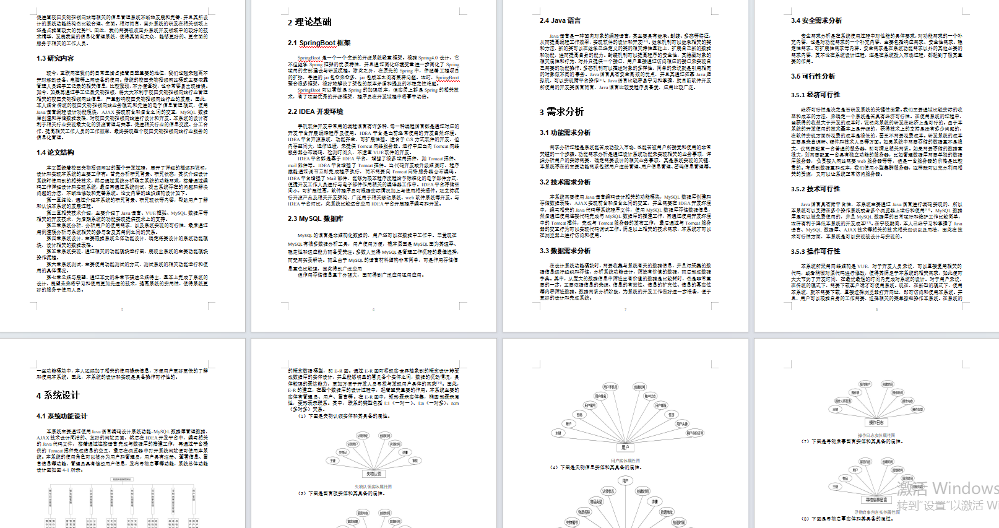

## 三、部分页面截图展示

### 用户页面

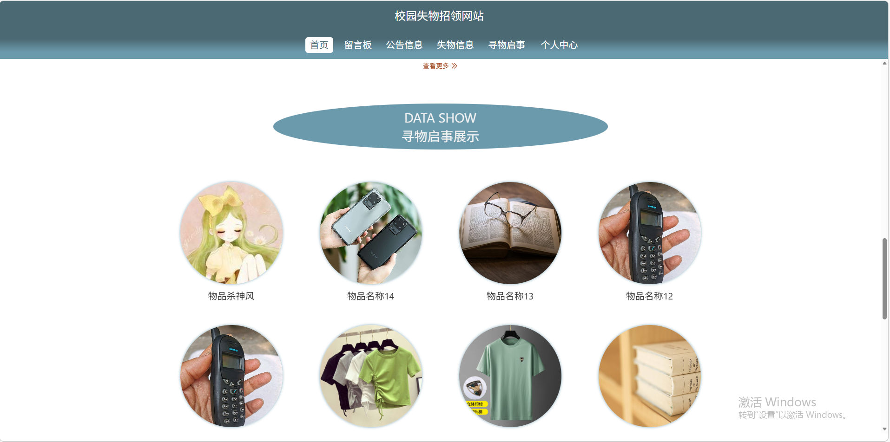

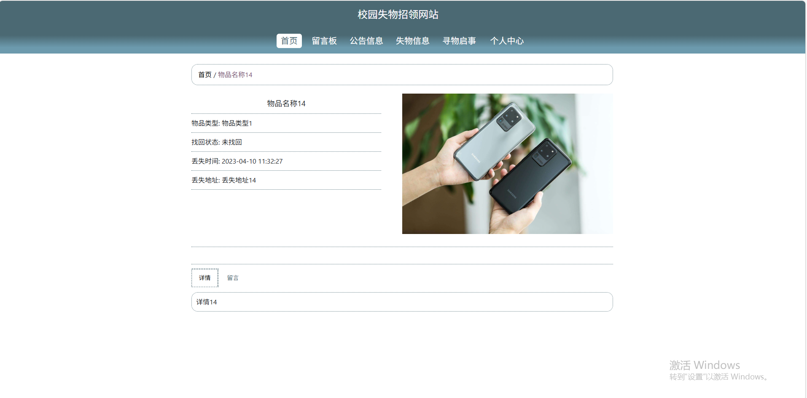

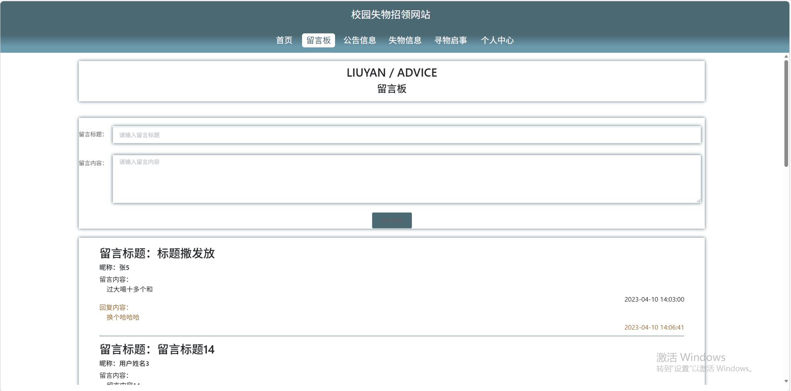

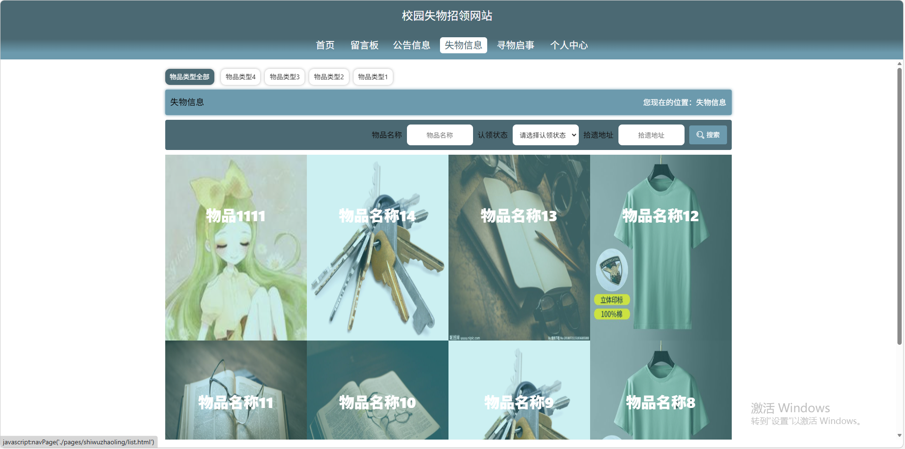

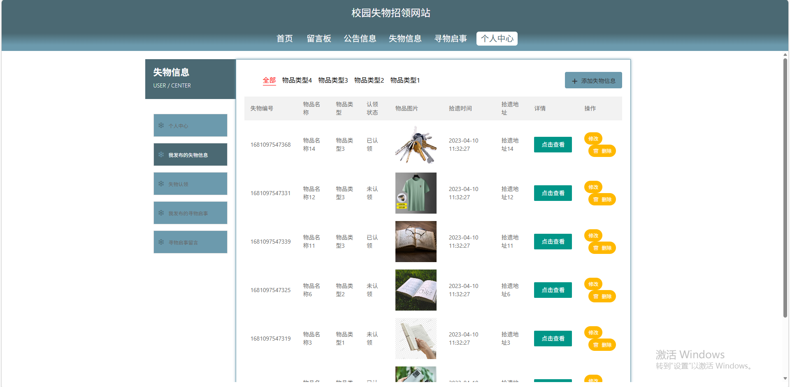

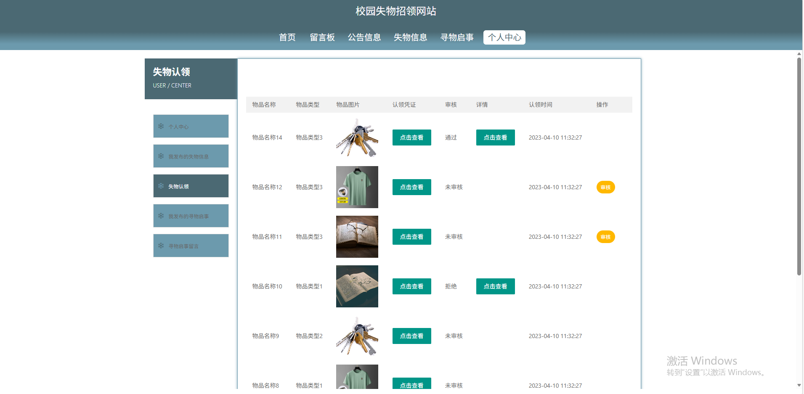

### 管理员页面

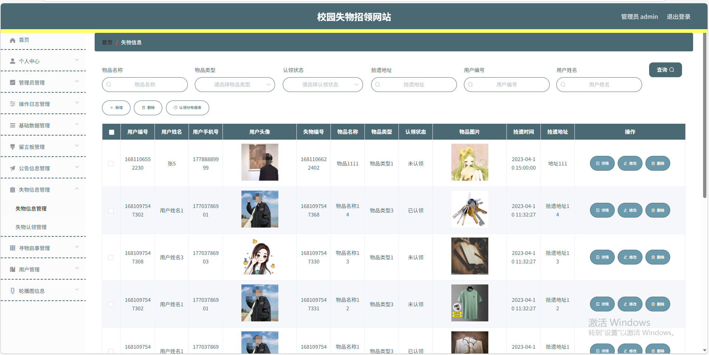

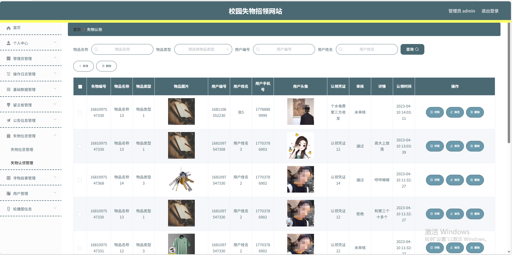

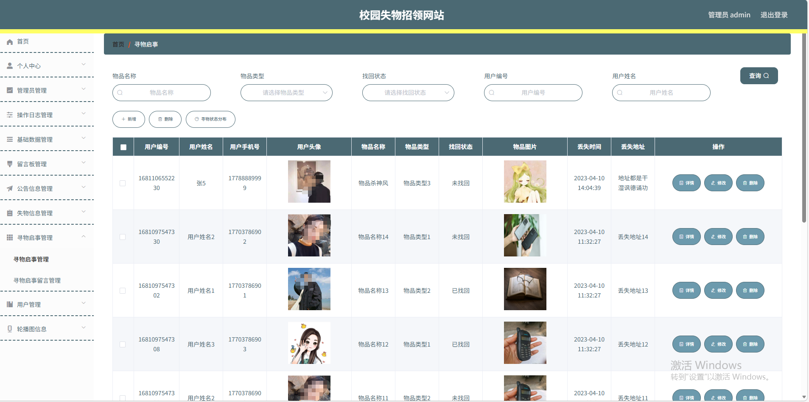

